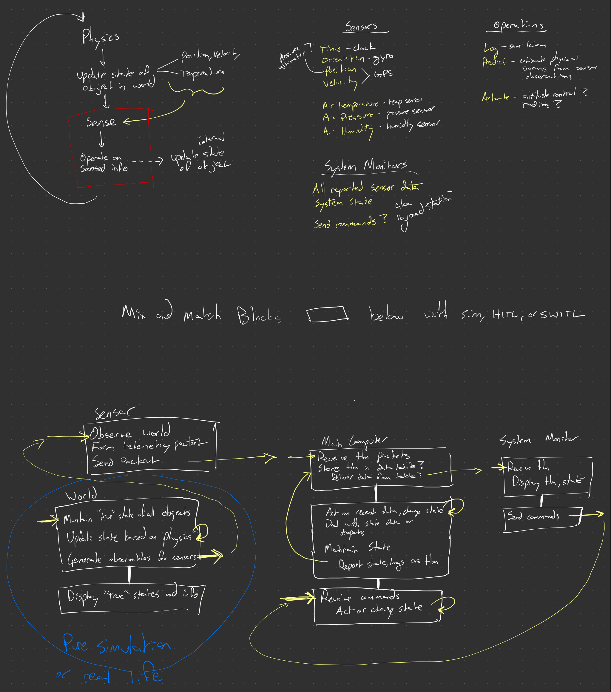

# System design

In the [introduction](introduction.md) I mentioned that Rust allows us to
_theoretically_ write everything in Rust. This is a sketch of how I think the
system will look in practice.

