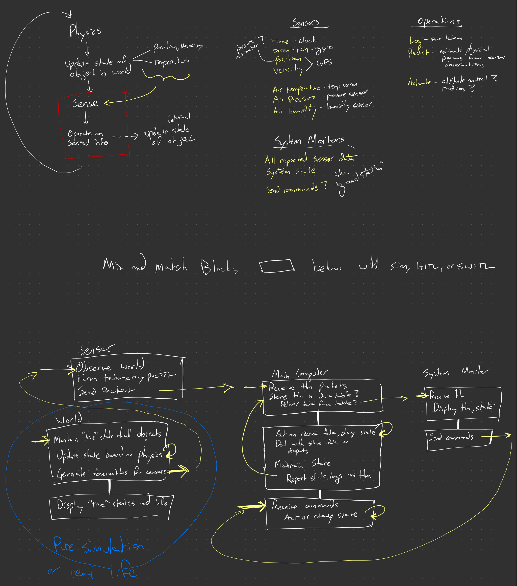

# Structure

In the [introduction](introduction.md) I mentioned that Rust allows us to
_theoretically_ write everything in Rust. This is a sketch of how I think the
system will look in practice.

Here are the main categories of systems I see:

- **Sensor** - interprets information about the world and convert it into data.
- **State** - represents the configuration of a system (and persists it!).
  - _Physical state_ governs interactions with the physical world.
  - _Logical state_ governs interactions within software.
- **Operator** - moves, mutates, and/or queries state or sensor data.
- **Actuator** - changes a physical state.
- **Transport** - moves data between systems.
- **Agent** - a system that combines sensors, state, operators, and actuators.
  Agents send and receive messages (or commands) to or from other agents.
- **User Interface** - a system that allows a human to observe or change data.

Let's see if we can break down those systems into "blocks" of systems.

- **The World** - Updating the "world state" of physical objects is pretty much
  a self-contained system. There are known physics rules and the state of those
  objects continues to evolve by those rules without any external input from an
  agent.
- **Sensors** - Physically, sensors are self-contained systems. They observe
  data about the world and convert it into some format, then ship it elsewhere.
  The source of the observation and the destination of the data can be
  abstracted or simulated or whatever. Sensors are often simple hardware
  systems. I think we can exclude microcontrollers from this category.
- **Computers** - Regardless of whether a computer is a microcontroller or runs
  an operating system or whatever, in this case I mean it as a system that takes
  in data, does something with it, and then outputs data. At the most basic
  level this would be a logger. More complicated systems could be an altitude
  controller. These systems are often much larger than sensors, but can still be
  contained relatively cleanly (and often along hardware boundaries).
- **User Interfaces** - CLIs or UIs that allow a human to observe or interact
  with a system are also nearly-completely self-contained systems and
  independent from all of the other systems at play.

Each of these "blocks" represents a system boundary that can be swapped in or
out with a simulation, abstraction, or an actual physical system. (The obvious
exception here is the "world" block, but hopefully it is equally obvious how to
swap that out with a simulation or real system... you fly it!)

| Block           | Examples                                 | Flavor of Rust                                      |
| --------------- | ---------------------------------------- | --------------------------------------------------- |
| The World       | Physics engine, weather simulation, etc. | Bevy (game engine) and/or regular Rust (std)        |
| Sensors         | IMU, GPS, etc.                           | Embedded Rust (no-std)                              |
| Computers       | Logger, altitude controller, etc.        | Regular Rust (std) or embedded Rust (no-std)        |
| User Interfaces | CLI, web app, etc.                       | Bevy (game engine), Egui, and/or regular Rust (std) |
