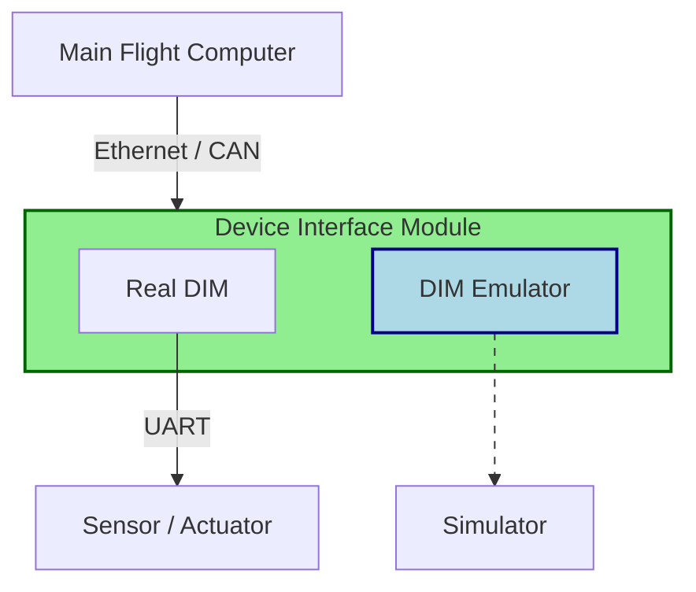

---
tags:
  - design
  - hardware
  - hwil
  - sim
---
# Emulation

Sensor emulation is useful for hardware- and software-in-the-loop testing because it enables total control of the observable environment from the vehicle's perspective.

An emulator is a device, usually a microcontroller, that produces synthetic data that is indistinguishable from the flight device. The emulator accepts signals (digital, analog, or command messages) from the host and emits signals or data that mimic the actual device.

Instead of sensing the actual environment or actuating a device, the emulator simulates a flight environment or any other fictional situation dictated by a separate host (not the vehicle) and produces signals that mimic what the emulated device would make in the corresponding situation. 

Emulation is coordinated by a separate host running a [simulated environment](simulation.md) that tells the emulator what to do. The simulated environment should also respond to actuator signals accordingly.

## DIM Emulator

A [[device-interface-module|Device Interface Emulator (DIM)]] sits in between the host vehicle's [[main-flight-computer|Main Flight Computer (MFC)]] and any device, such as a sensor or actuator. The DIM is the MFC's "gateway" to the low-level device. An emulator can pose as the real DIM as long as the interface to the MFC remains the same.

A **DIM Emulator** shares the same interface to the MFC as a normal DIM, but that's the only hardware requirement. The emulator uses whatever controller and software we want, as long as the signals over the MFC interface look right.

