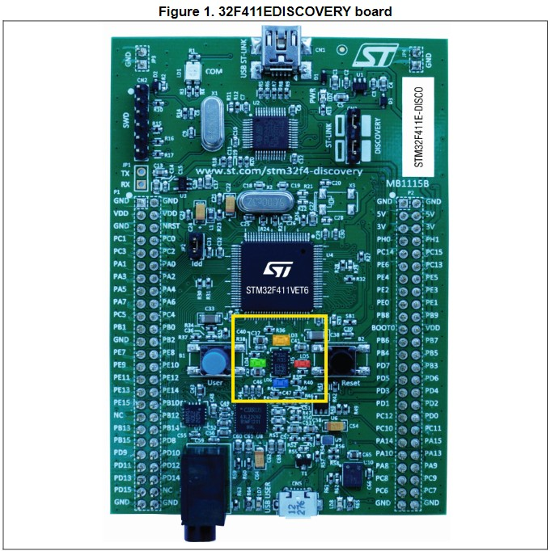

# Down Detector with STM32F411VE

There are 4 user LEDs on the STM32F411VE, and it also has a gyro. A simple demo
to practice working with the board could be to illuminate the LED that is
closest to "down" according to the sensors onboard. Eventually this sensor data
would be sent elsewhere, but why not start small.

| Name       | Color  | Notes                        |
| ---------- | ------ | ---------------------------- |
| `User LD3` | Orange | User-programmable at `PD13`. |
| `User LD4` | Green  | User-programmable at `PD12`. |
| `User LD5` | Red    | User-programmable at `PD14`. |
| `User LD6` | Blue   | User-programmable at `PD15`. |




```
Top View of Board (LEDs with colors and pins)
    
         North
           ▲ 
    [LD3]  │  [LD4]
    Orange │  Green
    PD13   │  PD12
    ───────┼─────── East
           │
    [LD6]  │  [LD5]
    Blue   │  Red
    PD15   │  PD14
         South


Example Orientations:

1. Board Tilted South
         ┌─────┐
         │     │
         │     │
         │  🔵 │  LD6 (Blue/PD15)
    ▲    └─────┘    lit when tilted
    │                south
    └── Level       


2. Board Tilted West
              ▲
    ┌─────┐   │
    │     │   │
    │  🟠 │   └── Level
    │     │
    └─────┘
    LD3 (Orange/PD13)
    lit when tilted west


3. Board at Rest (Flat)
    
    ┌─────┐   All LEDs off when
    │     │   board is level, or
    │     │   could show pattern
    │     │   to indicate level
    └─────┘   status
     Level


Key:
🟠 = Orange LED (LD3/PD13)
🟢 = Green LED (LD4/PD12)
🔴 = Red LED (LD5/PD14)
🔵 = Blue LED (LD6/PD15)
```

## Example by Claude 3

```rust
#![no_std]
#![no_main]

use defmt::*;
use embassy_executor::Spawner;
use embassy_stm32::gpio::{Level, Output, Speed};
use embassy_stm32::i2c::I2c;
use embassy_time::Timer;
use {defmt_rtt as _, panic_probe as _};

// L3GD20 gyroscope registers and constants
const L3GD20_ADDR: u8 = 0b110100_1; // I2C address
const CTRL_REG1: u8 = 0x20;
const OUT_X_L: u8 = 0x28;

struct GravityLeds {
    led_north: Output<'static>,  // LD4 Green  - PD12
    led_east: Output<'static>,   // LD5 Red    - PD14
    led_south: Output<'static>,  // LD6 Blue   - PD15
    led_west: Output<'static>,   // LD3 Orange - PD13
}

impl GravityLeds {
    fn new(
        pd12: Output<'static>,
        pd14: Output<'static>,
        pd15: Output<'static>,
        pd13: Output<'static>,
    ) -> Self {
        Self {
            led_north: pd12,
            led_east: pd14,
            led_south: pd15,
            led_west: pd13,
        }
    }

    fn all_off(&mut self) {
        self.led_north.set_high();
        self.led_east.set_high();
        self.led_south.set_high();
        self.led_west.set_high();
    }

    fn update_from_gyro(&mut self, x: i16, y: i16) {
        self.all_off();
        
        // Simple threshold-based LED activation
        const TILT_THRESHOLD: i16 = 1000;
        
        if x > TILT_THRESHOLD {
            self.led_east.set_low();
        } else if x < -TILT_THRESHOLD {
            self.led_west.set_low();
        }
        
        if y > TILT_THRESHOLD {
            self.led_north.set_low();
        } else if y < -TILT_THRESHOLD {
            self.led_south.set_low();
        }
    }
}

#[embassy_executor::main]
async fn main(_spawner: Spawner) -> ! {
    let p = embassy_stm32::init(Default::default());
    info!("Starting Gravity LED Demo!");

    // Initialize LEDs (active low)
    let leds = GravityLeds::new(
        Output::new(p.PD12, Level::High, Speed::Low), // North - Green
        Output::new(p.PD14, Level::High, Speed::Low), // East - Red
        Output::new(p.PD15, Level::High, Speed::Low), // South - Blue
        Output::new(p.PD13, Level::High, Speed::Low), // West - Orange
    );

    // Initialize I2C for gyroscope
    let scl = p.PB6;
    let sda = p.PB9;
    let mut i2c = I2c::new(p.I2C1, scl, sda, Default::default());

    // Initialize gyroscope
    // Enable X, Y axes and set to normal mode with 95Hz ODR
    i2c.write(L3GD20_ADDR, &[CTRL_REG1, 0b0000_1111]).await.unwrap();
    
    let mut buffer = [0u8; 6];
    
    loop {
        // Read X and Y axis data
        i2c.write_read(L3GD20_ADDR, &[OUT_X_L | 0x80], &mut buffer).await.unwrap();
        
        // Combine bytes into 16-bit values
        let x = i16::from_le_bytes([buffer[0], buffer[1]]);
        let y = i16::from_le_bytes([buffer[2], buffer[3]]);
        
        // Update LEDs based on orientation
        leds.update_from_gyro(x, y);
        
        // Small delay to avoid overwhelming the sensor
        Timer::after_millis(50).await;
    }
}
```
