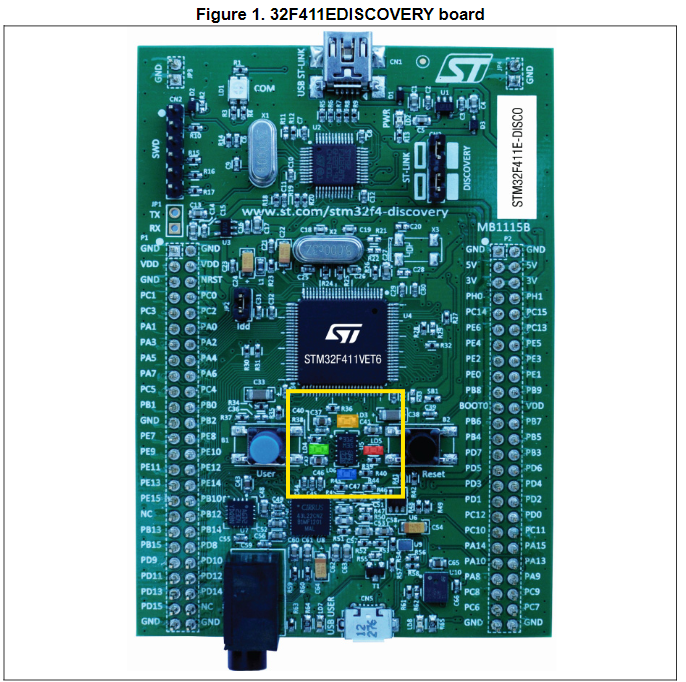

# Blinky with STM32F411VE

This page is a collection of notes on how to do a blinky program with the
STM32F411VE following this
[tutorial](https://www.youtube.com/watch?v=A9wvA_S6m7Y).

## Board familiarization

The [STM32F411VE](https://www.st.com/resource/en/datasheet/stm32f411ve.pdf) has
5 user-programmable LEDs and a few other indicator LEDs.

| Name       | Color     | Notes                                                                      |
| ---------- | --------- | -------------------------------------------------------------------------- |
| `LD1  COM` | Red/Green | Indicates communications are in progress between the PC and the ST-LINK/V2 |
| `LD2  PWR` | Red       | Indicates the board is powered                                             |
| `User LD3` | Orange    | User-programmable at `PD13`.                                               |
| `User LD4` | Green     | User-programmable at `PD12`.                                               |
| `User LD5` | Red       | User-programmable at `PD14`.                                               |
| `User LD6` | Blue      | User-programmable at `PD15`.                                               |
| `USB  LD7` | Green     | Indicates when `VBUS` is present on `CN5` and is connected to `PA9`        |
| `USB  LD8` | Red       | Indicates an overcurrent from `VBUS` of `CN5`                              |



Turn on the green LED, we need to set `PD12` to `HIGH`. To manipulate this pin
we need to make reads or writes to the GPIO peripheral that drives it.

From page 32 of the datasheet:

> Each of the GPIO pins can be configured by software as output (push-pull or
> open-drain, with or without pull-up or pull-down), as input (floating, with or
> without pull-up or pull-down) or as peripheral alternate function. Most of the
> GPIO pins are shared with digital or analog alternate functions. All GPIOs are
> high-current-capable and have speed selection to better manage internal noise,
> power consumption and electromagnetic emission.

1. Configure `PD12` as `GPIO_Output`. This pin can have alternate functions, so
   we have to tell it what function we want to use.
2. Set this pin to `HIGH` or `LOW` to turn the LED on or off.

> [!TIP]
>
> I ran into a lot of trouble getting the system to build and flash reliably.
> Eventually I found that embassy needs a specific combination of features to
> be enabled, and `probe-rs` needs to have certain options. See
> [captain's log 2024-12-19](../captains-log.md#2024-12-19) for details.

```rust
#![no_std]
#![no_main]

use defmt::*;
use embassy_executor::Spawner;
use embassy_stm32::gpio::{Level, Output, Speed};
use embassy_time::Timer;
use {defmt_rtt as _, panic_probe as _};

/// The entry point of the program.
///
/// This must never return. We denote this with `-> !` and make sure it happens
/// by including an unbounded loop in the function.
///
/// Print "Hello, world!" on startup then blink the green LED.
#[embassy_executor::main]
async fn main(_spawner: Spawner) {
    let p = embassy_stm32::init(Default::default());
    info!("Hello World!");

    let mut led = Output::new(p.PD12, Level::High, Speed::Low);

    loop {
        info!("high");
        led.set_high();
        Timer::after_millis(300).await;

        info!("low");
        led.set_low();
        Timer::after_millis(300).await;
    }
}
```

With embassy we can use `cargo run` to flash and run the program with logs
printed to the terminal as if we were running a native program.

```sh
❯ cargo run
   Compiling ahab_stm32f11ve v0.1.0 (E:\repos\philiplinden\ahab\crates\ahab_stm32f11ve)
    Finished `dev` profile [unoptimized + debuginfo] target(s) in 0.60s
     Running `probe-rs run --chip STM32F411VE --connect-under-reset E:\repos\philiplinden\ahab\target\thumbv7em-none-eabihf\debug\ahab_stm32f11ve`
      Erasing ✔ 100% [####################] 128.00 KiB @  53.98 KiB/s (took 2s)
  Programming ✔ 100% [####################]  72.00 KiB @  17.11 KiB/s (took 4s)
     Finished in 4.21s
0.000000 TRACE BDCR ok: 00008200
└─ embassy_stm32::rcc::bd::{impl#2}::init @ C:\Users\linde\.cargo\registry\src\index.crates.io-1949cf8c6b5b557f\embassy-stm32-0.1.0\src\fmt.rs:117
0.000000 DEBUG flash: latency=0
└─ embassy_stm32::rcc::_version::init @ C:\Users\linde\.cargo\registry\src\index.crates.io-1949cf8c6b5b557f\embassy-stm32-0.1.0\src\fmt.rs:130
0.000823 INFO  high
└─ ahab_stm32f11ve::____embassy_main_task::{async_fn#0} @ src\main.rs:24
0.301788 INFO  low
└─ ahab_stm32f11ve::____embassy_main_task::{async_fn#0} @ src\main.rs:28
0.602813 INFO  high
└─ ahab_stm32f11ve::____embassy_main_task::{async_fn#0} @ src\main.rs:24
0.903839 INFO  low
└─ ahab_stm32f11ve::____embassy_main_task::{async_fn#0} @ src\main.rs:28
```
