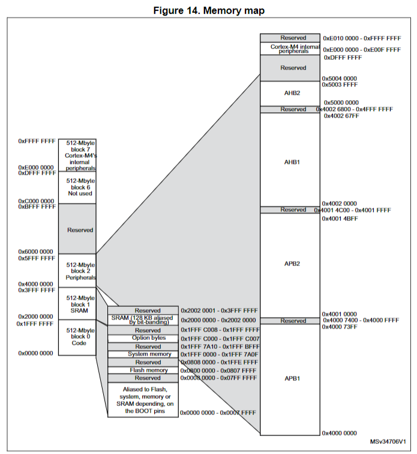

# Getting started with the STM32F411VE

Here are some notes on how to set up a development environment to work on this
project. YMMV.

I recommend following [this video tutorial](https://youtu.be/TOAynddiu5M) to get
started.

We'll use the
[STM32F411VE](https://www.st.com/resource/en/datasheet/stm32f411ve.pdf) as our
target system.

## Setting up your development environment

1. Install Rust 1.31 or newer.
2. Add cortex-m targets to your toolchain. We are using Cortex-M4F, so:
   `rustup target add thumbv7em-none-eabihf`
3. Read the [Embedded Rust Book](https://docs.rust-embedded.org/book) in its
   entirety. Just kidding, but it's a good idea to bookmark it.
4. If you're using VSCode or one of its derivatives, install the
   [rust-analyzer](https://rust-analyzer.github.io/) extension and the
   [Cortex-Debug](https://marketplace.visualstudio.com/items?itemName=marus25.cortex-debug)
   extension. There are some more details
   [here](https://github.com/rust-embedded/cortex-m-quickstart/blob/master/.vscode/README.md#customizing-for-other-targets)
   for advanced configurations.

## Setting up the project

### Configuring the compiler target

A target triple is a string that describes the target architecture, vendor,
operating system, and environment.

```
<arch><subarch>-<vendor>-<sys>-<env>
```

- `arch` is the architecture, e.g. `arm`, `x86`, `aarch64`, etc.
- `subarch` is the subarchitecture, e.g. `v7`, `v8`, `v9`, etc.
- `vendor` is the vendor, e.g. `none`, `apple`, `nvidia`, `intel`, etc.
- `sys` is the operating system, e.g. `none`, `linux`, `windows`, `macos`, etc.
- `env` is the environment, e.g. `eabihf`, `gnu`, `musl`, etc.

Both the MSP432 and the STM32F411E use the
[Cortex-M4F](https://developer.arm.com/Processors/Cortex-M4) with a floating
point unit. This chip is part of the ARMv7e-M architecture family.

The [rustc docs](https://doc.rust-lang.org/rustc/platform-support.html) show
that the target triple for ARMv7E-M is `thumbv7em-none-eabi` or
`thumbv7em-none-eabihf`.

- The `thumbv7em` prefix indicates that our Cortex-M4F uses the Thumb-2
  instruction set and the ARMv7E-M architecture.
- The `none` vendor indicates that the target does not have an operating system.
- The `eabi` or `eabihf` suffix indicates the
  [ABI](https://en.wikipedia.org/wiki/Application_binary_interface) to use.
  Since we have an FPU, we use the `eabihf` variant.

Now that we know the target triple, we can add it to the cargo toolchain on our
host machine and in our `.cargo/config.toml` file to tell the compiler how to
build code for the project's target.

```sh
# add the target architecture to the toolchain
rustup target add thumbv7em-none-eabihf
```

And to make sure the correct target and flags are used every `cargo build`, we
can add the following to our `.cargo/config.toml` file so we don't have to type
it out every time.

```toml
[build]
target = "thumbv7em-none-eabihf"     # Cortex-M4F and Cortex-M7F (with FPU)

[target.thumbv7em-none-eabihf]
rustflags = ["-C", "link-arg=-Tlink.x"]
```

But the IDE might still complain about failing to build the project for the host
architecture. We can instruct the IDE extensions to only build for the embedded
target by adding some extra configs. The following is an example for VSCode.

```json
// .vscode/settings.json
{
    "rust-analyzer.cargo.allTargets": false,
    "rust-analyzer.cargo.target": "thumbv7em-none-eabihf"
}
```

The [cortex-m-quickstart](https://github.com/rust-embedded/cortex-m-quickstart)
also includes a `build.rs` file that sets up the target triple and the linker
script, accounting for some of the edge cases that can happen when building to
make sure that the linker actually sees the `memory.x` file and stuff. Be
careful though, because the `build.rs` file also sets the rustflags so we have
to remove them from the `.cargo/config.toml` file if we use the `build.rs` file.

### Configuring the Cortex-M crates

The embedded Rust tools make it easy to build and run programs on the target but
require a little extra setup to get running for our specific target.

The first crate to set up is the runtime crate, `cortex-m-rt`. This crate
provides the `entry!` macro, which is used to mark the entry point of the
program, and interrupt handling.

```rust
// src/main.rs
#![no_std]
#![no_main]

use cortex_m_rt::entry;

#[entry]
fn main() -> ! {
    loop {
        // your code goes here
    }
}
```

The [cortex-m-rt](https://docs.rs/cortex-m-rt/latest/cortex_m_rt/) crate expects
a `memory.x` file that specifies the flash and RAM memory layouts of the target.
According to the datasheet, the flash memory is at `0x0800 0000 - 0x0807 FFFF`
and the RAM is at `0x2000 0000 - 0x2002 0000`.



Another thing that is required by the `cortex-m-rt` runtime is a panic handler.
A panic handler accepts a `PanicInfo` argument and never returns. This code will
run when the program (our code or a dependency) panics. It is required!

```rust
#![no_std]

#[panic_handler]
fn panic(_info: &PanicInfo) -> ! {
    // do something
}
```

There are more advanced ways to handle panics, including a number of third-party
crates, but for now we'll just set up a basic one: `panic-halt`. This crate
makes an infinite loop happen when a panic occurs, which can be helpful when
debugging. We should replace it later. Now we're not actually _using_ the
crate's functions, but we need to declare it so the compiler knows it exists.

```rust
// src/main.rs
#![no_std]
#![no_main]

use cortex_m_rt::entry;
use panic_halt as _;

#[entry]
fn main() -> ! {
    loop {
        // your code goes here
    }
}
```

### Flashing the device

There are a few more toolchains to install for ergonomics. `llvm-tools` enables
some low-level debugging and inspection features, and `cargo-binutils` is a more
ergonomic wrapper around `llvm-tools`.

```sh
rustup component add llvm-tools
cargo install cargo-binutils
```

Here's an example of how to use `cargo-binutils` to inspect the binary.

```sh
❯ cargo size -- -Ax
    Finished `dev` profile [unoptimized + debuginfo] target(s) in 0.02s
ahab_stm32f11ve  :
section                size         addr
.vector_table         0x400    0x8000000
.text                  0x70    0x8000400
.rodata                   0    0x8000470
.data                     0   0x20000000
.gnu.sgstubs              0    0x8000480
.bss                      0   0x20000000
.uninit                   0   0x20000000
.debug_abbrev        0x145d          0x0
.debug_info         0x23eef          0x0
.debug_aranges       0x1338          0x0
.debug_ranges       0x1b720          0x0
.debug_str          0x3d91c          0x0
.comment               0x99          0x0
.ARM.attributes        0x3a          0x0
.debug_frame         0x4218          0x0
.debug_line         0x2184d          0x0
.debug_loc             0x29          0x0
Total               0xa5691
```

One last tool is needed to flash the device. `probe-rs` is a tool that allows
you to interact with embedded devices, including flashing. Installation can vary
by OS, see [probe-rs docs](https://probe.rs/docs/getting-started/installation/)
for details. If you're on Windows, you might need to install
[some drivers](https://probe.rs/docs/getting-started/probe-setup/#windows%3A-winusb-drivers).

Let's see if `probe-rs` supports the STM32F411VE.

```sh
❯ probe-rs chip info stm32f411ve
stm32f411ve
Cores (1):
    - main (Armv7em)
NVM: 0x08000000..0x08080000 (512.0 kiB)
RAM: 0x20000000..0x20020000 (128.0 kiB)
NVM: 0x1fffc000..0x1fffc004 (4 B)
NVM: 0x1fff7800..0x1fff7a10 (528 B)
```

Yep! Now we want to use `cargo embed` to flash the device. `cargo-embed` is the
big brother of `cargo-flash`. It can also flash a target just like
`cargo-flash`, but it can also open an RTT terminal as well as a GDB server.

```sh
❯ cargo embed --chip stm32f411ve
    Finished `dev` profile [unoptimized + debuginfo] target(s) in 0.03s
      Config default
      Target E:\repos\philiplinden\ahab\target\thumbv7em-none-eabihf\debug\ahab_stm32f11ve
      Erasing ✔ 100% [####################]  16.00 KiB @  40.12 KiB/s (took 0s)
  Programming ✔ 100% [####################]   2.00 KiB @   4.08 KiB/s (took 0s)
     Finished in 0.49s
        Done processing config default
```

We can cache the chip info so we don't have to type it out every time using an
`Embed.toml` file that `cargo embed` will look for in the project root.

```toml
# Embed.toml
chip = "stm32f411ve"
```

Now we can run `cargo embed` and it will pull the arguments from the config.

```sh
❯ cargo embed
    Finished `dev` profile [unoptimized + debuginfo] target(s) in 0.02s
      Config default
      Target E:\repos\philiplinden\ahab\target\thumbv7em-none-eabihf\debug\ahab_stm32f11ve
      Erasing ✔ 100% [####################]  16.00 KiB @  40.25 KiB/s (took 0s)
  Programming ✔ 100% [####################]   2.00 KiB @   4.15 KiB/s (took 0s)
     Finished in 0.48s
        Done processing config default
```

😎
